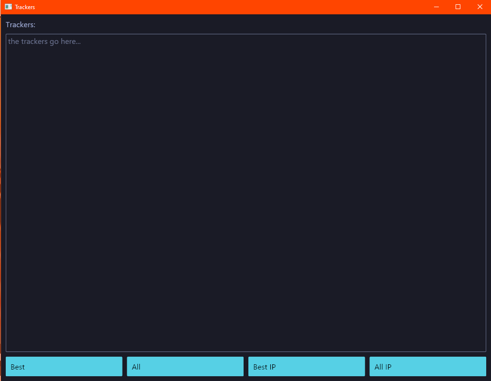

# TrackersGUI

[](https://forthebadge.com)

A GUI in pure Rust to get public trackers list from [ngosang/trackerslist](https://github.com/ngosang/trackerslist). Port of [PublicTrackersGUI](https://github.com/DarkCeptor44/PublicTrackersGUI) to Rust.



## Installation

You can either get a binary from [Releases](https://github.com/DarkCeptor44/trackers-gui/releases) or setup [Rust](https://rustup.rs/) and build it yourself:

```bash
git clone https://github.com/DarkCeptor44/trackers-gui
cd trackers-gui
cargo build --release
```

You will find the binary in `target\release`.

## Audits

Using [cargo-audit](https://crates.io/crates/cargo-audit)

```text
Crate:     instant
Version:   0.1.13
Warning:   unmaintained
Title:     `instant` is unmaintained
Date:      2024-09-01
ID:        RUSTSEC-2024-0384
URL:       https://rustsec.org/advisories/RUSTSEC-2024-0384
Dependency tree:
instant 0.1.13
├── parking_lot_core 0.8.6
│   └── parking_lot 0.11.2
│       └── wasm-timer 0.2.5
│           └── iced_futures 0.13.2
│               ├── iced_winit 0.13.0
│               │   └── iced 0.13.1
│               │       └── trackersgui 2.0.0
│               ├── iced_runtime 0.13.2
│               │   ├── iced_winit 0.13.0
│               │   └── iced_widget 0.13.4
│               │       └── iced 0.13.1
│               ├── iced_graphics 0.13.0
│               │   ├── iced_winit 0.13.0
│               │   ├── iced_wgpu 0.13.5
│               │   │   └── iced_renderer 0.13.0
│               │   │       ├── iced_widget 0.13.4
│               │   │       └── iced 0.13.1
│               │   ├── iced_tiny_skia 0.13.0
│               │   │   └── iced_renderer 0.13.0
│               │   └── iced_renderer 0.13.0
│               └── iced 0.13.1
└── parking_lot 0.11.2

Crate:     paste
Version:   1.0.15
Warning:   unmaintained
Title:     paste - no longer maintained
Date:      2024-10-07
ID:        RUSTSEC-2024-0436
URL:       https://rustsec.org/advisories/RUSTSEC-2024-0436
Dependency tree:
paste 1.0.15
└── metal 0.27.0
    └── wgpu-hal 0.19.5
        ├── wgpu-core 0.19.4
        │   └── wgpu 0.19.4
        │       ├── iced_wgpu 0.13.5
        │       │   └── iced_renderer 0.13.0
        │       │       ├── iced_widget 0.13.4
        │       │       │   └── iced 0.13.1
        │       │       │       └── trackersgui 2.0.0
        │       │       └── iced 0.13.1
        │       └── iced_glyphon 0.6.0
        │           └── iced_wgpu 0.13.5
        └── wgpu 0.19.4

warning: 2 allowed warnings found
```

## License

This project is licensed under the MIT License, see the [LICENSE](LICENSE) file.
